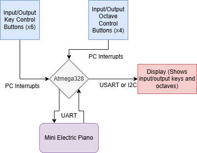
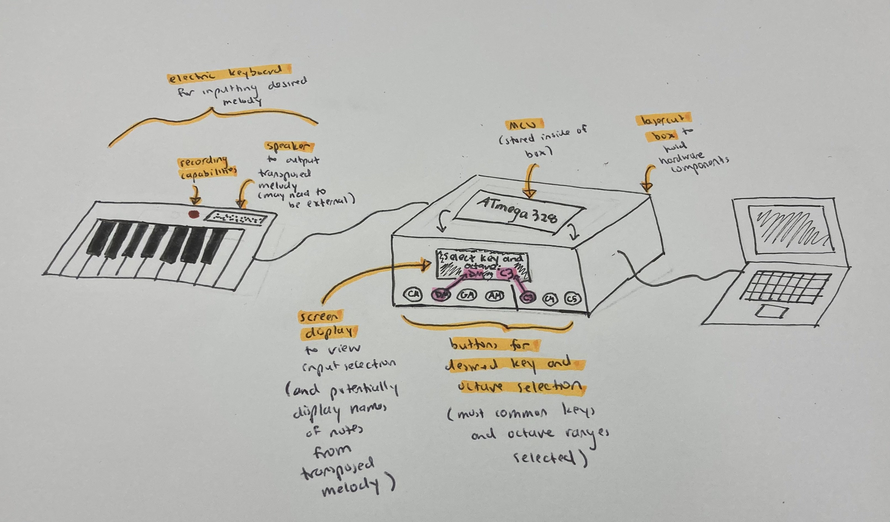

# Music to my Ears

* Team Number: 17
* Team Name: The Redeem Team
* Team Members: Garrett Kirsch, Nikolaos Rapanis, Melina Daniilidis
* GitHub Repository URL: https://github.com/upenn-embedded/final-project-s25-the-redeem-team.git
* GitHub Pages Website URL: 

## Final Project Proposal

### 1. Abstract

This project is a music transcriber: it takes in a melody played on an electric piano, converts it to a key and octave of your choosing, then plays it back to the user for quick testing. 

### 2. Motivation

Many musicians (*cough* singers) don't know how to read sheet music and haven't learned anything about music theory. This makes it difficult for them to adapt their music to different keys as they don't have the necessary theory background.

This product will allow them, and learned musicians that couldn't be bothered, to quickly alter their melodies to fit a different key or octave, either for stylistic purposes or because the original music was not in their range.

Key benefits: quick testing of new ideas, easy accessibility to people without music theory backgrounds.

### 3. System Block Diagram

Critical Components: (likely will not need power regulation circuits)
- Electric piano
- Atmega328PB
- Video Display
- Control Buttons (might replace with a WiFi chip and an app if time allows)

### 4. Design Sketches

*What will your project look like? Do you have any critical design features? Will you need any special manufacturing techniques to achieve your vision, like power tools, laser cutting, or 3D printing?*

### 5. Software Requirements Specification (SRS)

*Formulate key software requirements here. Think deeply on the design: What must your device do? How will you measure this during validation testing? Create 4 to 8 critical system requirements.*

*These must be testable! See the Final Project Manual Appendix for details. Refer to the table below; replace these examples with your own.*

**5.1 Definitions, Abbreviations**

Here, you will define any special terms, acronyms, or abbreviations you plan to use for hardware

**5.2 Functionality**

| ID     | Description                                                                                                                                                                                                              |
| ------ | ------------------------------------------------------------------------------------------------------------------------------------------------------------------------------------------------------------------------ |
| SRS-01 | The user’s manual input of the current key (via button press) should be consistent with the notes of the inputted melody, i.e. we check that the notes of the inputted melody match the key signature of the manually inputted initial key. If they don’t match, an error message shall be displayed to the user, and perhaps a few compatible keys can be suggested by the system (this would be an advanced feature).                                                                                                                  |
| SRS-02 | The notes from the input recording shall be cleaned and parsed accurately based on their frequencies. For initial testing, we will assume that one note is placed at a time (no chords) and the melody is not more than seven notes. Once it can parse this simple input successfully, we will incrementally test chords and more complex melodies.                                                                                                                                           |
| SRS-03 | The screen display shall correctly depict the selected key and octave from the button presses. |
| SRS-04 | The user shall not be able to select a desired key transcription that is not compatible with the key of the current melody (e.g. the user cannot select to transcribe to a minor key if the inputted melody is in a major key).                                                                                 |
| SRS-05 | The transcription algorithm shall correctly transcribe the melody into the user’s desired key and octave. The validation for this will involve several stages of testing. First, we will test with a limited selection of keys (namely, the most common ones: C major, D major, G major, A major) and with one standard octave (C4). After we confirm that the algorithm can accurately transcribe a few simple melodies with these common keys in C4, then we can gradually add one or two octaves (as many as the keyboard allows) and test. Finally, we can begin adding and testing more complex keys or test more complex input melodies with the common keys.                                                                                 |
| SRS-06 | The speaker shall correctly output the transcribed melody. We will test on the same types of inputs as the transcription algorithm and in similar order.                                                                               |
| SRS-07 | The screen should correctly display the names of the notes from the transposed melody in a readable format, so the user can try to play the transposed melody on the keyboard if they so choose.                                                                                |
| SRS-08 | The screen should display the transcribed notes and the speaker will play the frequencies of the transcribed notes simultaneously.                                                                                |                                                                           

### 6. Hardware Requirements Specification (HRS)

| ID     | Description                                                                                                                        |
| ------ | ---------------------------------------------------------------------------------------------------------------------------------- |
| HRS-01 | A mini electric piano will be used to provide inputs (i.e. music) that will then be processed by the atmega           |
| HRS-02 | The mini-piano will also be used to output music - both the raw inputs and the transcribed outputs                   |
| HRS-03 | 4 buttons will be used to choose the input key of the music. |
| HRS-04 | 4 buttons will be used to choose the output key of the music   |
| HRS-05 | A screen will be used to display the input key, output key, input octave, and output octave of the music.      |
| HRS-06 | 2 buttons will be used to cycle through octaves.                   |

### 7. Bill of Materials (BOM)

*What major components do you need and why? Try to be as specific as possible. Your Hardware & Software Requirements Specifications should inform your component choices.*

Piano: It is a MIDI keyboard chosen for full-size velocity-sensitive keys, real-time note transmission over 5-pin DIN (not USB), and wide availability.

MIDI Cable: Standard 5 pin M-M cable, compatible with SDS-50J.

6N138: Opto-isolator. Required for signal preservation according to the datasheet. Supports 31,250 baud rate we need for UART.

SDS-50J Connector: Matches the pins from the cable to wires.

AST-03008MR-R Buzzer: Externally driven (PWM) magnetic buzzer with wide frequency range (300–8,000 Hz) to play all the notes.

1N4148 Diode: Required for circuit protection by the datasheet.

1.8" Color TFT LCD display with MicroSD Card Breakout - ST7735R: We already have this screen, so we will use this.

Potential resistors/transistors/breadboards/cables/buttons/potentiometres (we will get them through detkin).

*In addition to this written response, copy the Final Project BOM Google Sheet and fill it out with your critical components (think: processors, sensors, actuators). Include the link to your BOM in this section.*

https://docs.google.com/spreadsheets/d/1vXRE2RFJ4J_eHgv4eHKd_utGaQBJlPumqM2778kMy1A/edit?gid=253149064#gid=253149064

### 8. Final Demo Goals

*How will you demonstrate your device on demo day? Will it be strapped to a person, mounted on a bicycle, require outdoor space? Think of any physical, temporal, and other constraints that could affect your planning.*

We will put the mini piano and our other components on the workbench. We will play a melody on the piano while in listening mode, the MCU will read the signals from it, and then we will turn a physical switch on the board to choose the transposition of the song. Then we will press a button for a buzzer to play the song in the new key.

Our system does not need any special environment - just a countertop. We will power the system with a laptop/battery/DC supply.

The constraint is just enough space on the workbench.

### 9. Sprint Planning

*You've got limited time to get this project done! How will you plan your sprint milestones? How will you distribute the work within your team? Review the schedule in the final project manual for exact dates.*

| Milestone  | Functionality Achieved | Distribution of Work |
| ---------- | ---------------------- | -------------------- |
| Sprint #1  | Input circuit works, we have connection between the piano and the MCU; UART works and we get response; Parsing notes and timings   | Nikolaos - Circuitry; Melina: UART enable communication and load the notes; Garrett: MIDI keyboard works + mock input test    |
| Sprint #2  |  Transposition works and we are able to produce correct new frequencies; Timing works and buzzer (+ circuit) is able to produce notes.       |  Garrett & Melina - Timing logic; Nikolaos: being able to programme the output to the buzzer, programme switch, testing that everything works  |
| MVP Demo   |   Everything works together maybe with some integration issues, but reliable input/output  |  All hands: Team works together to integrate the different parts each one made. We reharse and made sure we have a viable MVP |
| Final Demo |   Final polish, potential UX enhancement (LEDs etc), edge cases, make sure everything works flawlessly         |    All hands work together because 6 eyes/ears are better than 2 in catching issues                 |

**This is the end of the Project Proposal section. The remaining sections will be filled out based on the milestone schedule.**

## Sprint Review #1

### Last week's progress

### Current state of project

### Next week's plan

## Sprint Review #2

### Last week's progress

### Current state of project

### Next week's plan

## MVP Demo

1. Show a system block diagram & explain the hardware implementation.
2. Explain your firmware implementation, including application logic and critical drivers you've written.
3. Demo your device.
4. Have you achieved some or all of your Software Requirements Specification (SRS)?

   1. Show how you collected data and the outcomes.
5. Have you achieved some or all of your Hardware Requirements Specification (HRS)?

   1. Show how you collected data and the outcomes.
6. Show off the remaining elements that will make your project whole: mechanical casework, supporting graphical user interface (GUI), web portal, etc.
7. What is the riskiest part remaining of your project?

   1. How do you plan to de-risk this?
8. What questions or help do you need from the teaching team?

## Final Project Report

Don't forget to make the GitHub pages public website!
If you’ve never made a GitHub pages website before, you can follow this webpage (though, substitute your final project repository for the GitHub username one in the quickstart guide):  [https://docs.github.com/en/pages/quickstart](https://docs.github.com/en/pages/quickstart)

### 1. Video

[Insert final project video here]

* The video must demonstrate your key functionality.
* The video must be 5 minutes or less.
* Ensure your video link is accessible to the teaching team. Unlisted YouTube videos or Google Drive uploads with SEAS account access work well.
* Points will be removed if the audio quality is poor - say, if you filmed your video in a noisy electrical engineering lab.

### 2. Images

[Insert final project images here]

*Include photos of your device from a few angles. If you have a casework, show both the exterior and interior (where the good EE bits are!).*

### 3. Results

*What were your results? Namely, what was the final solution/design to your problem?*

#### 3.1 Software Requirements Specification (SRS) Results

*Based on your quantified system performance, comment on how you achieved or fell short of your expected requirements.*

*Did your requirements change? If so, why? Failing to meet a requirement is acceptable; understanding the reason why is critical!*

*Validate at least two requirements, showing how you tested and your proof of work (videos, images, logic analyzer/oscilloscope captures, etc.).*

| ID     | Description                                                                                               | Validation Outcome                                                                          |
| ------ | --------------------------------------------------------------------------------------------------------- | ------------------------------------------------------------------------------------------- |
| SRS-01 | The IMU 3-axis acceleration will be measured with 16-bit depth every 100 milliseconds +/-10 milliseconds. | Confirmed, logged output from the MCU is saved to "validation" folder in GitHub repository. |

#### 3.2 Hardware Requirements Specification (HRS) Results

*Based on your quantified system performance, comment on how you achieved or fell short of your expected requirements.*

*Did your requirements change? If so, why? Failing to meet a requirement is acceptable; understanding the reason why is critical!*

*Validate at least two requirements, showing how you tested and your proof of work (videos, images, logic analyzer/oscilloscope captures, etc.).*

| ID     | Description                                                                                                                        | Validation Outcome                                                                                                      |
| ------ | ---------------------------------------------------------------------------------------------------------------------------------- | ----------------------------------------------------------------------------------------------------------------------- |
| HRS-01 | A distance sensor shall be used for obstacle detection. The sensor shall detect obstacles at a maximum distance of at least 10 cm. | Confirmed, sensed obstacles up to 15cm. Video in "validation" folder, shows tape measure and logged output to terminal. |
|        |                                                                                                                                    |                                                                                                                         |

### 4. Conclusion

Reflect on your project. Some questions to address:

* What did you learn from it?
* What went well?
* What accomplishments are you proud of?
* What did you learn/gain from this experience?
* Did you have to change your approach?
* What could have been done differently?
* Did you encounter obstacles that you didn’t anticipate?
* What could be a next step for this project?

## References

Fill in your references here as you work on your final project. Describe any libraries used here.
